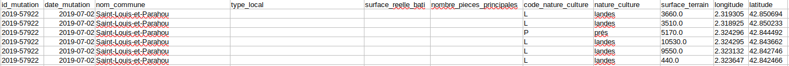
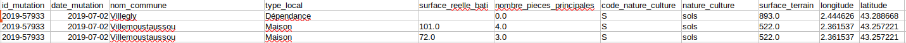
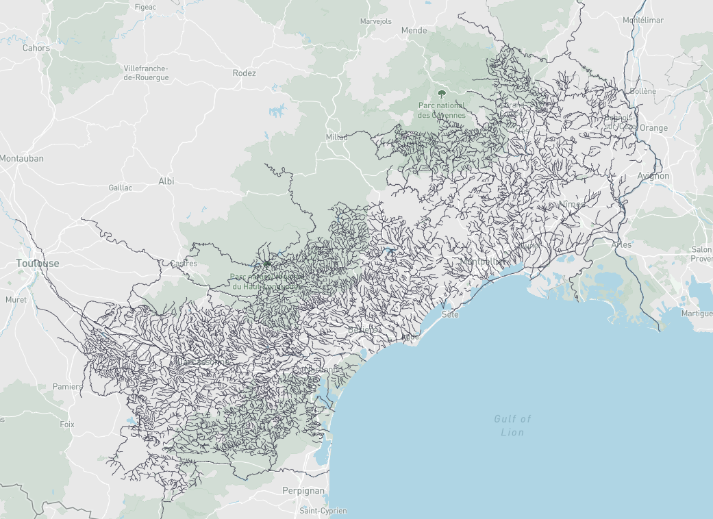
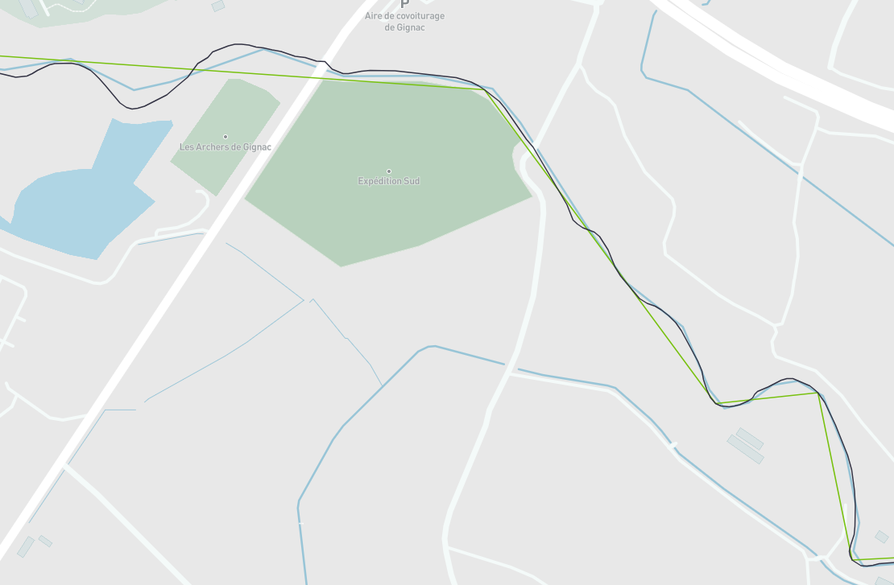

# Note de mi-parcours: Risque d’inondation, prix immobilier et distance à la rivière la plus proche

## Auteurs
- **Philémon Pensier**  
- **Younès Iggidr**  
- **Raphael Zambelli--Palacio**

## Introduction
Le but de cette étude est de modéliser et d'estimer l'effet du risque d'inondation sur les prix de transaction des logements. 

En effet, le changement climatique, amplifié par les activités humaines, intensifie la fréquence et la gravité des catastrophes naturelles. Parmi elles, les inondations constituent un risque majeur, notamment dans le sud de la France, comme on peut le voir ces dernières années dans l'actualité. Selon les derniers rapports du GIEC, la montée des eaux et l’augmentation des épisodes de précipitations extrêmes accentuent l’exposition de nombreuses régions aux crues, entraînant des conséquences économiques et sociales considérables.

Dans ce contexte, notre étude se concentre sur trois départements de la région Occitanie : l’Aude, le Gard et l’Hérault. Situés dans une zone méditerranéenne sujette aux épisodes cévenols, ces territoires sont particulièrement exposés aux risques d’inondation. Ces phénomènes météorologiques, caractérisés par des précipitations soudaines et intenses, entraînent des crues rapides qui peuvent causer d’importants dégâts matériels. Il est alors pertinent de tenter d'évaluer l’impact de ce risque sur la valorisation des biens immobiliers : de prime abord, on pourrait s’attendre à une décote significative pour les logements situés dans ces zones à risque et c'est ce que nous allons essayer de confirmer ou d'infirmer dans cette étude.

Pour cette analyse, nous nous concentrons exclusivement sur les maisons. En effet, la base de données utilisées pour avoir les transactions concernant des ventes de logement ne fournissent pas en général l’étage pour les appartements, ce qui empêche d’évaluer précisément leur vulnérabilité aux inondations. En nous focalisant sur les maisons, nous nous assurons de travailler sur des biens dont l’exposition au risque est homogène et directement liée à leur localisation en rez-de-chaussée.

## Les données
- Les fichiers DVF (Demande de Valeurs Foncières) sur les 5 dernières années. La base de données « Demandes de valeurs foncières », ou DVF, recense l’ensemble des ventes de biens fonciers réalisées au cours des cinq dernières années. Elles proviennent des actes enregistrés chez les notaires et des informations contenues dans le cadastre.
Cette base de données contient ainsi les caractéristiques internes des logements concernés par les transactions (nombre de pièces, nombre de dépendances, superficie du terrain).
- Les fichiers Géorisques des zones inondables. Les fichiers Georisques sont réalisés en partenariat entre le Ministère de la Transition Écologique, de la Biodiversité, de la Forêt, de la Mer et de la Pêche et le BRGM. Il s'agit de fichiers géographiques disponibles au format shapefile contenant les zones à risque. Il existe trois différents risques répertoriés:
  - débordement de cours d'eau: le risque d'inondation correspond ici aux crues des fleuves et rivières
  - submersion marine: il s'agit ici du risque d'inondation lié aux inondations provenant de la mer
  - ruissellement: ici le risque d'inondation est causé par le relief
Pour chaque risque, nous considérons différents niveaux d'aléa (fort, moyen et faible) correspondant à des probabilités différentes 
- Les cours d’eau. Nous utiliserons la base de données SANDRE (Service National d'Administration des Données et Référentiels sur l'Eau). 

### Le travail effectué sur les données

#### Sur les fichiers DVF 

Nous nous sommes d'abord débarassé de toutes les transactions n'étant pas des ventes (par exemple les expropriations ne sont pas prises en compte).
Ensuite, il fallait conserver uniquement les transactions concernant des maisons. Le but étant d'obtenir un dataframe où chaque ligne (qui correspondra à chaque transaction pour notre régression linéaire) corresponde à exactement une maison, il a fallu prendre en compte plusieurs cas de figure :

- les transactions sans maison, à retirer
- les transactions avec plusieurs maisons
- les transactions avec au moins une maison et une dépendance

Il a fallu alors décider plusieurs choses :

- Comment calculer le prix des maisons individuellement ? L'option choisie ici est de leur attribuer une part de la valeur totale de la transaction proportionnelle à leur surface.
- Puis, comment attribuer les dépendances à des maisons ? Pour les dépendances se trouvant sur la même parcelle qu'une maison, on les attribue à la maison en question. Pour le reste, on les attribue proportionnellement aux autres maisons.

A la fin de ces traitements, nous obtenons environ 100 000 transactions.

#### Sur les fichiers Georisque

Nous avons effectué un appariement spatial avec les fichiers DVF pour attribuer une variable indicatrice à chaque transaction pour tous les risques (submersion, débordement et ruissellement) et tous les différents niveaux d'aléa possibles (fort, moyen et faible)

#### Sur les cours d’eau

A partir de la base de données SANDRE, nous avons effectué un appariement géographique avec les départements pour obtenir tous les cours d'eau appartenant aux trois départements cévenols. Ce qui donne environ 4000 cours d’eau.

Comme nous avons environ 100 000 transactions, nous devons donc calculer environ 400 millions de distances. Nous reviendrons ultérieurement sur la nécessité de calculer les distances aux rivières. De plus, il s'agit ici de distances entre des points et des polylignes (géographiquement le tracé d'une rivière est en effet composé de différents points définissant son parcours, les points étant reliés entre eux par des segments). Pour obtenir la distance minimale entre un point et une rivière, il faut donc calculer la distance entre le projeté orthogonal du point et chaque droite définissant un segment de la polyligne. Si le projeté orthogonal n'est pas situé sur le segment, on prend alors la distance à une des deux extrémités du segment.
En supposant que chaque rivière ou polyligne est composée de 1000 noeuds, il faudrait donc effectuer 400 milliards de calculs de distances. Le temps de calcul supposé s'établit ainsi à environ 15 heures.
Nous avons cependant pu réduire le temps de calcul en utilisant l'agorithme Douglas-Peucker de généralisation cartographique. Cet algorithme consiste à supprimer un certain nombre de sommets composant la polyligne. Le temps de calcul a ainsi été réduit d'un facteur 4, passant de 15 heures à environ 3 heures 30.

En utilisant un index spatial, c'est-à-dire en récupérant les rivières les plus proches de chaque transaction appartenant au DVF pour calculer les distances, le temps de calcul est très similaire à celui obtenu avec l'algorithme de Douglas-Peucker. Les deux liens suivants donnent davantage d'information sur l'algorithme Douglas-Peucker: [Douglas-Peucker](https://fr.wikipedia.org/wiki/Algorithme_de_Douglas-Peucker) et les index spatiaux: [index spatiaux](https://fr.wikipedia.org/wiki/R-arbre).

### Quelques statistiques descriptives du jeu de données

Ci-dessous, les statistiques pour le risque de débordement:

|           | pourcentage de transactions | prix moyen au m2 | décote (par rapport à la moyenne en%) |
|-----------|:-----------:|------------:|:-----------:|
| **risque fort** | 1.6   | 2244   | 10.6   |
| **risque moyen** | 5.4   | 2300   | 8.3   |
| **risque faible** | 7.9   | 2399   | 4.4   |

Nous pouvons observer que le nombre de transactions potentiellement affecté par des risques de débordement est assez conséquent dans les trois département cévenols (7.9%). Les prix au m2 est aussi plus faible pour les transactions situées en zone inondable. 

Ci-dessous, les statistiques pour le risque de submersion:

|           | pourcentage de transactions | prix moyen au m2 | décote (par rapport à la moyenne en%) |
|-----------|:-----------:|------------:|:-----------:|
| **risque fort** | 0.4   | 4762   | -89.8   |
| **risque moyen** | 2.4   | 3675   | -46.5   |
| **risque faible** | 3.8   | 3702   | -47.5   |

Ici, le nombre de transactions est plus réduit que pour le risque de débordement. Surtout, on observe que les maisons sont plus onéreuses lorsque le risque est fort, c'est-à-dire en se rapprochant du bord de mer. 

Enfin, dans notre jeu de données, il n'y a pas de transactions en zone à risque ruissellement.

## Stratégie d’identification

Dans cette étude, nous recherchons l'effet d'être en zone inondable sur les prix des transactions immobilières. Pour ce faire, nous ne pouvons pas nous contenter d'effectuer une regression des prix sur la variable indicatrice d'être ou non en zone à risque. En effet, les transactions en zone à risque sont potentiellement différentes des autres transactions. On dit alors qu'il existe un biais de sélection. Comme nous venons de le voir ci-dessus, les transactions en bord de mer bien que se situant en zone à risque sont davantage onéreuses, il existe en effet un attrait du bord de mer. Nous allons donc devoir ajouter des variables de contrôle à notre régression pour isoler l'effet d'être en zone à risque sur le prix. Nous allons par exemple devoir contrôler par la distance au bord de mer. 

Nous allons donc construire un modèle hédonique, c'est-à-dire un modèle économétrique prenant en compte les caractéristiques du logement pour expliquer les différences de prix observées.

Ci-dessous, la liste des variables de contrôle envisagées dans un premier temps dans la régression :

- Distance à la rivière la plus proche (être peu éloigné d'une rivière peut être attrayant)
- Distance au centre-ville (peut être matérialisé par la mairie de la commune concernée)
- Distance au littoral (pour capturer l'attrait du littoral)
- Effet propre à la commune qui va capter l'attractivité de celle-ci (nous pouvons pour cela utiliser le prix moyen au m2 sur la commune)
- Plus les caractéristiques internes du bien (nombre de pièces, superficie du terrain, nombre de dépendances) qui sont normalement contenues dans les fichiers DVF

## Perspectives
Ultérieurement, nous pourrons ajouter d'autres variables de contrôle (infrastructures de transport, hôpitaux, écoles) ayant un effet sur le prix des biens.
Il sera également opportun de réfléchir à d'autres modélisations possibles comme par exemple des régressions sur discontinuité. 
